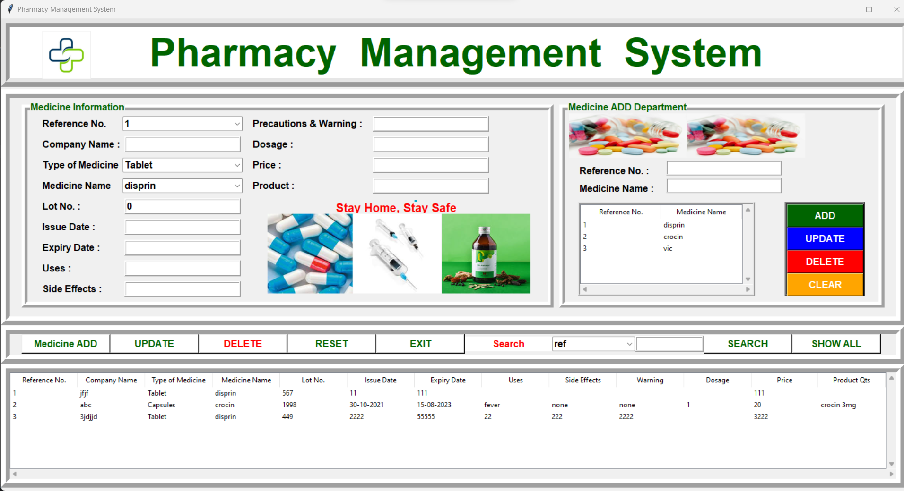
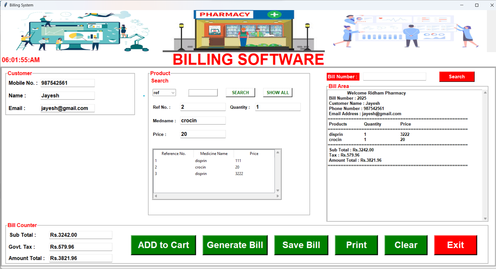

# Pharmacy Management System

A desktop-based Pharmacy Management System built using **Python** and **Tkinter** to manage medicines, sales, customers, and billing. Designed for small to mid-sized medical stores to maintain inventory efficiently and improve transaction handling.

## Features

- Add, update, delete medicines
- Real-time inventory management
- Customer record management
- Bill generation and sales tracking
- Search functionality for medicines
- Summary of daily transactions
- GUI using Tkinter for easy interaction

## Tech Stack

- **Language:** Python
- **GUI Library:** Tkinter
- **Database:** MySQL

## Getting Started

### Prerequisites

- Python 3.x installed  
- Required libraries:
  ```bash
  pip install tk

### Steps to Run

1. Clone the repository or download the ZIP folder.
2. Navigate to the project directory.
3. Run the following command:
   ```bash
   python main2.py

## Screenshots

| Home Screen | Billing Page |
|-------------|--------------|
|  |  |


